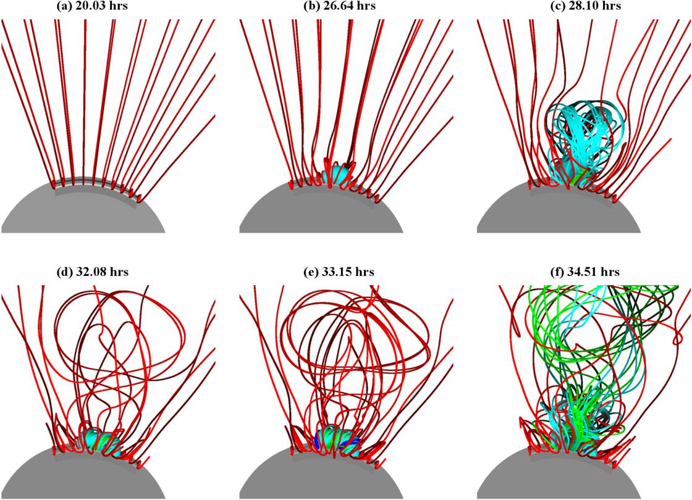
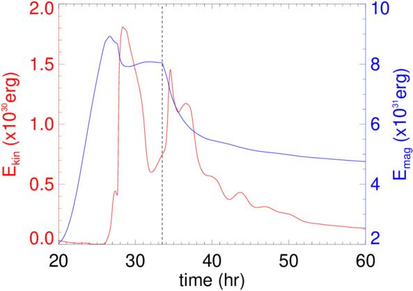
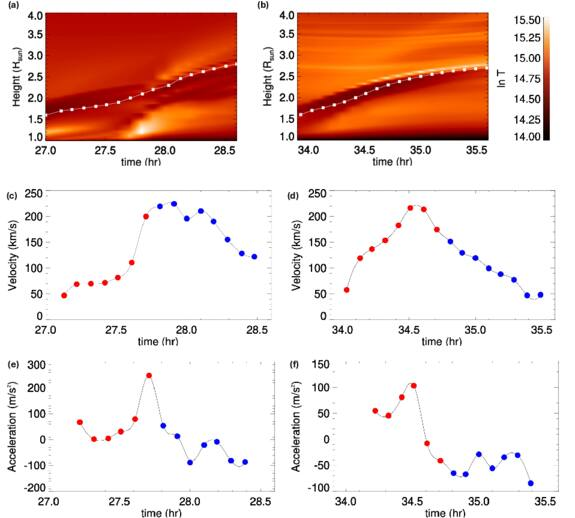
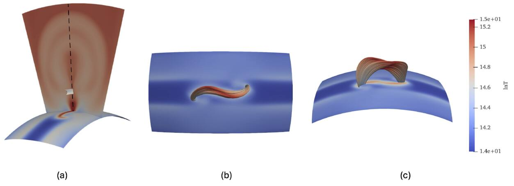
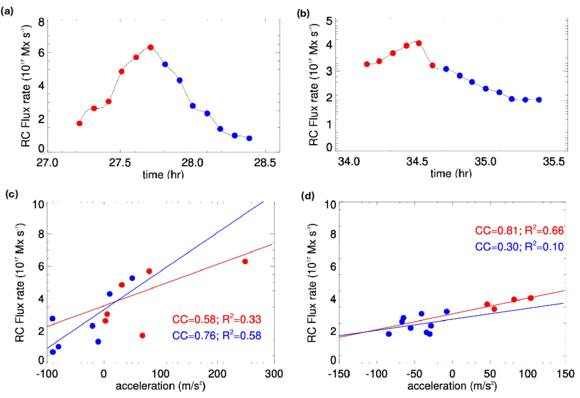
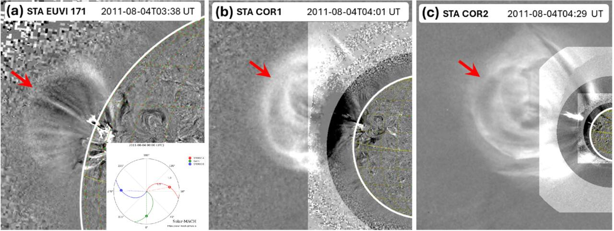
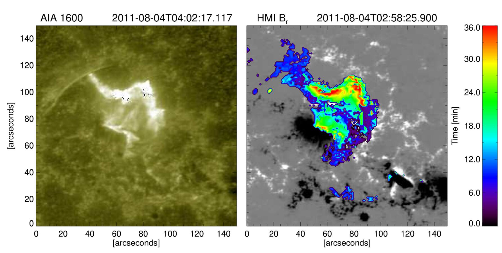
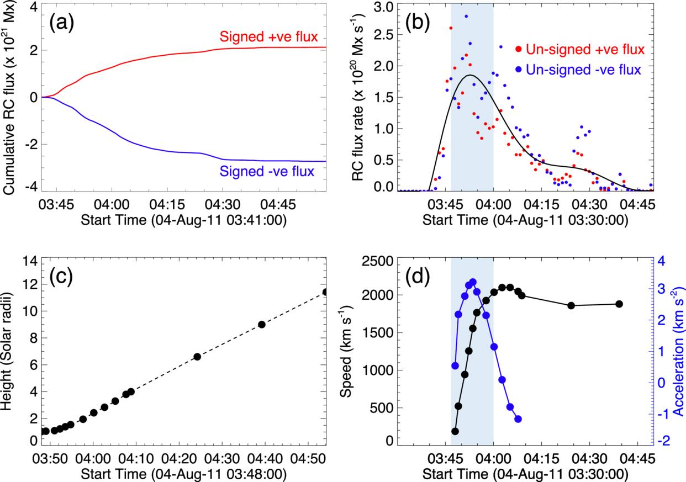

# Unraveling the Sun's Explosive Secret: How Magnetic Reconnection Drives Coronal Mass Ejections

*A deep dive into the magnetic choreography behind one of the solar system's most powerful phenomena*

Every so often, the Sun hurls billions of tonnes of magnetized plasma into space at speeds exceeding a thousand kilometers per second. These events — **coronal mass ejections**, or CMEs — are not random outbursts. They are the culmination of a carefully orchestrated buildup of magnetic stress, a slow-burning fuse that eventually triggers one of nature's most dramatic explosions. Understanding precisely *how* and *when* that fuse ignites is one of the central unsolved problems in solar physics — and one with profound consequences for our increasingly technology-dependent civilization.

Our new study, published in *The Astrophysical Journal* (Maity et al. 2026), takes a significant step toward answering that question by tracing the temporal evolution of **magnetic reconnection flux** during the full lifecycle of erupting magnetic flux ropes — from their quiet emergence through the solar corona to their explosive expulsion as CMEs.

## The Magnetic Architecture of a CME

At the core of nearly every CME lies a **magnetic flux rope (MFR)**: a coherent bundle of helical magnetic field lines winding around a common axis. Whether MFRs exist in the corona *before* an eruption or are assembled *during* one remains a matter of active debate. What is generally agreed upon is that the MFR constitutes the primary magnetic skeleton of the ejected structure, and that **magnetic reconnection (RC)** — the topological restructuring of magnetic field lines accompanied by energy release — plays a pivotal role in its evolution.

The quantity that most directly characterizes this reconnection process is the **reconnection flux**: the magnetic flux threading through the current sheet that forms beneath the rising flux rope. This is the magnetic fuel being processed during a solar flare, and it leaves observable signatures in the low solar atmosphere in the form of **flare ribbons** — bright ultraviolet and optical emission patches that sweep outward as newly reconnected field lines map their footpoints across the photosphere.

Despite its importance, the *temporal evolution* of RC flux during the full arc of an eruption — from the slow pre-eruptive rise phase through the impulsive acceleration and into the post-eruptive decay — has never been comprehensively characterized in a physically self-consistent simulation. That is precisely the gap our work addresses.

## A Physically Realistic 3D MHD Simulation

We solve the complete set of compressible MHD equations in 3D spherical coordinates using the **Pencil Code** — an open-source, MPI-parallelized, high-order finite difference code. Our computational domain spans a spherical wedge from **1 to 6 solar radii**, resolved on a **512 × 288 × 160** non-uniform grid. Critically, unlike many earlier eruption simulations, our model incorporates a suite of physical processes that bring it much closer to realistic coronal conditions:

| Physical Process | Implementation |
|---|---|
| Optically thin radiative cooling | Modified Cook et al. (1989) cooling function |
| Explicit coronal heating | Height-dependent exponential heating function |
| Field-aligned thermal conduction | Hyperbolic Spitzer diffusion approach |
| High Alfvén speed handling | Semirelativistic Boris correction |

The initial corona is set up as a **hydrostatic isothermal atmosphere at 10⁶ K**, threaded by a potential arcade magnetic field. Into this configuration, we introduce a twisted toroidal flux rope through the lower coronal boundary via an imposed electromotive force, which bodily advects the torus upward at a sub-Alfvénic speed of **2 km s⁻¹**. This quasi-static emergence approach — following the methodology pioneered by Fan (2009, 2010, 2012) and Chatterjee & Fan (2013) — ensures that the corona remains close to force-free equilibrium during the flux injection phase, preventing spurious numerical eruptions and guaranteeing that any instability that develops is of genuine physical origin (torus instability or helical kink instability).

## Watching a Flux Rope Come Alive: The 3D Evolution

The simulation's most visually striking output is the 3D evolution of the coronal magnetic field as the flux rope emerges, rises, and eventually erupts. The figure below captures six key moments in this process.

*Figure 1: 3D evolution of the magnetic field of the twisted flux rope emerging into the corona at six timestamps. Red field lines belong to the ambient arcade; blue (core), green (middle), and cyan (periphery) field lines originate from the emerging flux rope at increasing distances from its axis. The flux rope first appears in the corona at t = 20.3 hr.*

At **t = 20.03 hr**, the coronal field is dominated entirely by the large-scale ambient arcade — a clean, organized potential field. There is no sign yet of the eruption to come. By **t = 26.64 hr**, the emerging flux rope has pushed into the corona and begun compressing and stretching the overlying arcade field. The buildup of magnetic stress is visible in the distortion of the ambient field lines. At **t = 28.10 hr**, the first eruption is underway: the flux rope has broken free of the overlying field restraint, and a tangled ball of cyan, green, and blue field lines marks the ejected MFR core.

The lower row captures the *reformation* phase and the second eruption cycle. By **t = 32.08 hr**, a new current channel has developed above the same polarity inversion line. At **t = 33.15 hr**, this new rope is rising quasi-statically, recapitulating the behavior of its predecessor. Finally, at **t = 34.51 hr**, the second eruption is in full swing — remarkably similar in morphology to the first, confirming the **homologous** character of the two events.

## Two Homologous Eruptions and Their Energy Budget

Our simulation produces **two successive homologous CME eruptions**, triggered at *t* = 27.7 hr and *t* = 34.8 hr. The energetics of both events are summarized in the figure below.

*Figure 3: Total kinetic energy E_kin (red) and total magnetic energy E_mag (blue) as a function of time. Each eruption appears as a sharp spike in kinetic energy accompanied by a corresponding drop in magnetic energy. The dashed vertical line marks the time when flux emergence stops.*

The mechanism driving these homologous events is the continuous formation of new current sheets above the same **polarity inversion line (PIL)** following each eruption. As fresh twisted flux is driven through the lower boundary, a new sigmoid-shaped current layer develops beneath the rising rope. Reconnection within this layer adds flux to the rope, enabling a new quasi-static rise phase before the next loss of equilibrium.

Each eruption is characterized by an impulsive spike in kinetic energy and a corresponding drop in magnetic energy — the canonical signature of an eruptive flare. Two distinct kinetic energy peaks are clearly visible, confirming the homologous nature of the events. The gradual decline in magnetic energy between eruptions reflects the ongoing reconnection that builds flux into the reforming rope. After flux emergence stops (dashed line), a second eruption cycle still completes — demonstrating that the stored free energy in the coronal field is sufficient to power the second CME without additional flux injection.

## Kinematics of the Erupting Flux Rope

The height–time, velocity, and acceleration profiles of both eruptions are shown below, tracked by following the dark (cool) region in the meridional temperature plane — the observational proxy for the MFR core.

*Figure 4: (a)–(b) Height–time profiles of the flux rope core for the first (left) and second (right) eruptions, derived from temperature maps in the r–θ plane. The white dotted line traces the MFR trajectory. (c)–(d) Velocity profiles. (e)–(f) Acceleration profiles. Red circles: pre-eruption phase. Blue circles: post-eruption phase.*

The first ejection achieves a peak radial velocity of **224 km s⁻¹**, slightly exceeding the **213 km s⁻¹** of the second event. The acceleration panels (e) and (f) reveal a striking pattern: the acceleration rises sharply during the pre-eruptive phase, peaks near the eruption time, and then turns negative as the CME decelerates due to adiabatic expansion. This deceleration in the low corona — visible in both simulation and observational data — is a feature often overlooked in studies that focus only on CME speeds measured at several solar radii.

## The Current Sheet: Where the Action Happens

Central to the entire eruption process is the formation of a **current sheet (CS)** beneath the rising flux rope — the site where magnetic field lines of opposite polarity are forced together, eventually breaking and reconnecting. The figure below shows the CS and its associated sigmoid field lines as identified from our simulation at t = 27.32 hr, just before the peak of the first eruption.

*Figure 2: The current sheet (panel a, white isosurface) traced from the temperature isosurface at log T = 6.6 × 10, located at ~1.4 R☉ above the lower boundary. Sigmoid field lines passing through the current sheet are shown in panels (b) and (c) from different viewing angles. These field lines carry the reconnection flux.*

The sigmoid morphology of the current layer — clearly visible in panels (b) and (c) — is a well-known observational signature of pre-eruptive flux ropes in active regions. In our simulation, this current layer is not merely a passive bystander: reconnection within it actively adds twisted flux to the rising MFR, sustaining and accelerating the eruption in a positive feedback loop.

We quantify the RC flux by computing the magnetic flux swept by flare ribbons at the lower boundary — a well-established proxy for the flux threading the current sheet, formalized as:

$$\Phi_{\rm RC} = \int B_n \, dS = \int B_r \, dA$$

where $B_r$ is the radial magnetic field at the ribbon footpoints near the lower boundary, and $dA$ is the elemental ribbon area. This indirect measure — tracing the footpoints of newly reconnected field lines rather than attempting to measure the CS interior directly — is both physically well-motivated and operationally consistent with how reconnection flux is estimated from solar observations. he peak RC rates for the two eruptions are:

- **First eruption:** 6.49 × 10¹⁷ Mx s⁻¹
- **Second eruption:** 4.10 × 10¹⁷ Mx s⁻¹

These values are consistent with observationally inferred reconnection rates for comparable M-class events.

## The Central Finding: Reconnection Rate Tracks CME Acceleration

The most significant result of our study is quantified in the figure below, which shows the time evolution of the RC rate alongside scatter plots of RC rate versus MFR acceleration for both eruptions.

*Figure 5: (a)–(b) Time evolution of the RC flux rate for the first (left) and second (right) eruptions. Red circles: pre-eruption; blue circles: post-eruption. (c)–(d) Scatter plots of RC rate vs. MFR radial acceleration. Red lines: linear fits before eruption; blue lines: after eruption. Pearson correlation coefficients (CC) and R² values are annotated.*

Before the eruption, the scatter plots reveal a clear **monotonic relationship between the RC rate and the CME acceleration**, with Pearson correlation coefficients of **CC = 0.58 (R² = 0.33)** and **CC = 0.81 (R² = 0.66)** for the two eruptions respectively. After the eruption, the correlation weakens as the current sheet fragments and the magnetic topology becomes increasingly disordered — reflected in the lower post-eruption CC values.

This relationship has a physically transparent interpretation. As the flux rope rises and compresses the overlying field, the current sheet beneath it intensifies, driving faster reconnection. The reconnected field lines form the growing flare arcade, whose magnetic pressure provides an upward push on the overlying rope — a **positive feedback loop** that progressively amplifies the eruption. The reconnection rate therefore serves as a real-time proxy for the rate at which magnetic free energy is being converted into kinetic energy of the ejecta.

After the eruption, the RC rate decreases as the current sheet fragments and the magnetic topology becomes increasingly complex. The flux rope velocity itself begins to decline in the post-eruptive phase — a consequence of adiabatic expansion and magnetic cloud cooling — mirroring the deceleration profiles reported in observational studies such as Sarkar et al. (2019).

## Observational Validation: The 2011 August 4 M-class Flare

To test whether this simulation-derived correlation has real-Sun counterparts, we analyze the well-observed eruptive M-class flare **SOL2011-08-04T03:41** in AR 11261. This event offers a rare geometric advantage:

- **On-disk view (SDO/HMI + AIA):** The active region was located near solar disk center (30°–35° west), providing reliable line-of-sight magnetograms and AIA 1600 Å flare ribbon observations for RC flux estimation
- **Near-limb view (STEREO-A):** Separated from the Sun–Earth line by 101°, enabling accurate height-time tracking of the CME leading edge with EUVI, COR1, and COR2

### Multi-Spacecraft Observations

*Figure 6: Different phases of the 2011 August 04 CME eruption as observed by STEREO-A. (a) EUVI 171 Å base-difference image showing the early eruption at 03:38 UT. The inset shows the orbital configuration of STEREO-A (red), Earth (green), and STEREO-B (blue) on 2011 August 4, with STEREO-A at 101° separation. (b) COR1 base-difference image superimposed with EUVI 171 Å at 04:01 UT. (c) COR2 image at 04:29 UT showing the CME front well into the outer corona. Red arrows indicate the CME leading edge.*

STEREO-A — separated from the Sun–Earth line by **101°** — observed this event as a near-limb CME, enabling accurate height-time tracking of the leading edge across three instruments: EUVI (< 1.7 R☉), COR1 (1.3–4 R☉), and COR2. Meanwhile, the active region was located near solar disk center (30°–35° west) as seen from Earth, providing reliable line-of-sight magnetograms from SDO/HMI and flare ribbon observations from AIA 1600 Å.

### Flare Ribbons and Reconnection Flux

*Figure 7: Left panel: flare brightening observed in AIA 1600 Å at 04:02:17 UT during the M-class flare in AR 11261. The characteristic two-ribbon morphology is clearly visible. Right panel: co-temporal HMI B_r magnetogram (gray scale, saturated at ±500 G) overlaid with the temporal evolution of the flare ribbons from 03:41 to 04:17 UT on 2011 August 4. The color bar encodes time in minutes, showing the outward ribbon separation as reconnection proceeds.*

The AIA 1600 Å image (left) captures the characteristic two-ribbon flare morphology — the photospheric footprints of the newly formed post-flare loops. The HMI overlay (right) maps these ribbons onto the underlying magnetic field, showing how they sweep outward across regions of opposite magnetic polarity over the course of ~36 minutes. This ribbon sweeping area, multiplied by the underlying magnetic field strength, gives the reconnection flux as a function of time.

### Kinematics and Reconnection Flux: The Observed Correlation

*Figure 8: (a) Signed cumulative RC flux integrated over positive (red) and negative (blue) magnetic polarities. (b) Unsigned instantaneous RC flux rate for positive (red) and negative (blue) polarities; black curve is the fitted profile. The cyan shaded region marks the period of peak acceleration. (c) Height–time plot of the CME leading edge from STEREO EUVI, COR1, and COR2. (d) CME speed (black) and acceleration (blue) profiles derived from panel (c).*

The results are striking. The cumulative RC flux (panel a) reaches ~2 × 10²¹ Mx for the positive polarity — a value consistent with M-class flare reconnection budgets. The instantaneous RC flux rate (panel b) peaks near **2.8 × 10²⁰ Mx s⁻¹** around 03:50–04:00 UT, coinciding precisely with the period of peak CME acceleration (cyan shaded region in panels b and d). The CME reaches a peak speed of ~**2100 km s⁻¹** before gradually decelerating — a profile that closely mirrors the post-eruption deceleration seen in our simulation.

The correlation coefficients between RC rate and CME acceleration for this observed event are **CC = 0.90 (pre-eruption)** and **CC = 0.98 (post-eruption)**.The simultaneous rise of RC flux and CME acceleration is fully consistent with the simulation's prediction of a positive pre-eruptive correlation. This finding aligns with the large statistical study by Zhu et al. (2020), who found correlation coefficients ranging from 0.68 to 0.99 across a sample of 60 CME–flare events.

## Conclusion

The Sun continues to surprise us. But with each new simulation and each carefully analyzed event, the magnetic choreography behind its most spectacular eruptions becomes a little clearer. The monotonic link between **reconnection rate and CME acceleration** — seen consistently in both our 3D MHD simulations and in multi-spacecraft observational data — suggests that the seeds of a CME's explosive journey are already being sown during its quiet, pre-eruptive rise. Tracking those seeds in real time, through the sweeping footprints of flare ribbons, may one day be the key to forecasting the most dangerous solar storms before they reach Earth.

*This research was supported by the Indo-US Science and Technology Forum (IUSSTF/JC-113/2019). Observational data were provided by NASA's SDO/HMI and AIA instruments and the STEREO spacecraft. Open access is funded by Helsinki University Library.*

*Full paper: Maity, S. S., Chatterjee, P., Sarkar, R., & Mytheen, I. S. 2026, The Astrophysical Journal, 1000, 315. DOI: [10.3847/1538-4357/ae3d9a](https://doi.org/10.3847/1538-4357/ae3d9a)*
